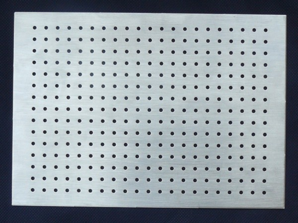

<!--- module --->
# ALBASE1521
<!--- Emodule --->

<!--- subtitle ---><!--- Esubtitle --->
MLAB base-board with size 15x21 holes with standard MLAB grid 400mils (10.16mm). The board on the sides contains a series of M3 holes with a metric pitch (10 mm) and three holes for stacking the boards above each other.

<!--- description --->ALBASE1521<!--- Edescription --->
            
